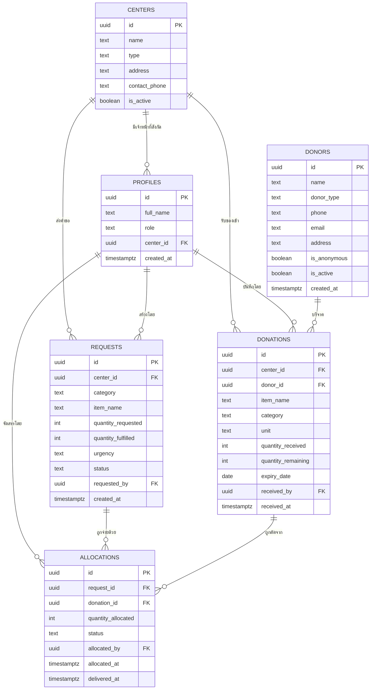
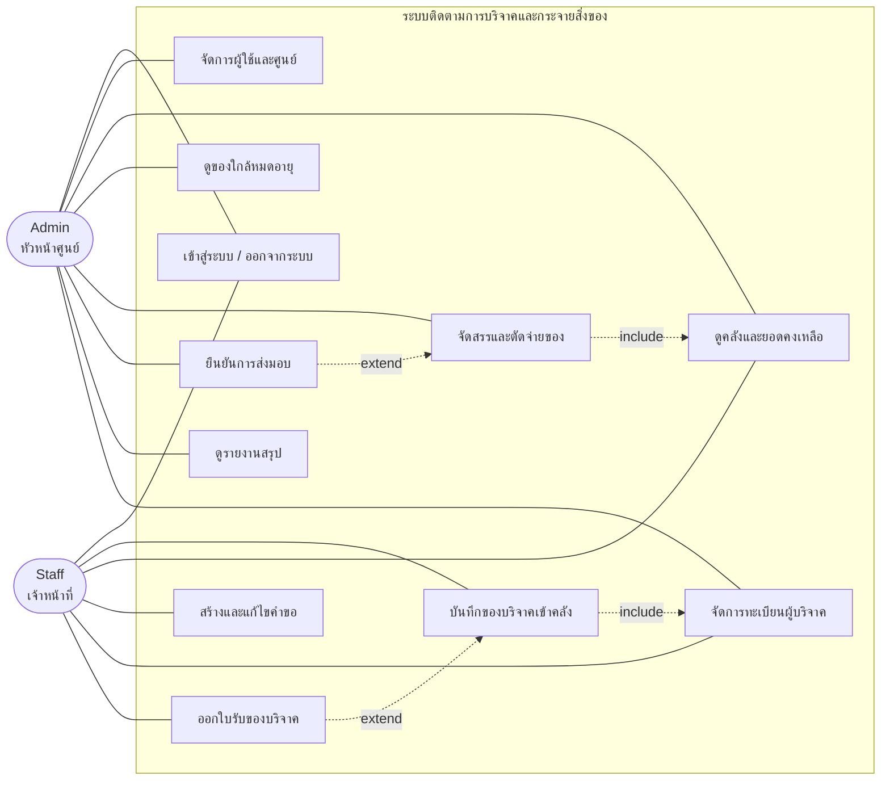

# Mini Project — ระบบติดตามการบริจาคและกระจายสิ่งของช่วยเหลือภัยพิบัติ

**COE67-331 Web Application Development · Topic 8 · เอกสารส่ง Week 10**

Stack: Next.js (App Router) + TypeScript + Tailwind CSS + Supabase + Vercel

---

## 1. บริบทของโจทย์ (Short Report — ย่อหน้าเปิด)

> เมื่อเกิดภัยพิบัติ เช่น อุทกภัยในพื้นที่ภาคใต้ ปัญหาที่พบซ้ำทุกครั้งไม่ใช่การขาดแคลนน้ำใจ แต่คือการที่ของบริจาคจำนวนมากกองรวมกันโดยไม่มีระบบบันทึกว่ามีอะไรอยู่เท่าไร ทำให้ศูนย์พักพิงบางแห่งได้รับน้ำดื่มและข้าวสารเกินความจำเป็นจนหมดอายุ ขณะที่บางแห่งขาดแคลนของใช้จำเป็น เช่น ผ้าอนามัย นมผง หรือยาสามัญประจำบ้าน ระบบนี้จึงถูกออกแบบให้เป็นเครื่องมือทำงานของเจ้าหน้าที่ศูนย์รับบริจาค โดยบันทึกของที่รับเข้า ติดตามยอดคงเหลือแบบเรียลไทม์ตามการตัดจ่าย รับคำขอจากศูนย์พักพิงพร้อมระดับความเร่งด่วน และจัดสรรของออกโดยตรวจสอบยอดคงเหลือและวันหมดอายุก่อนอนุมัติทุกครั้ง ผลลัพธ์คือความโปร่งใสในการกระจายทรัพยากร ลดของเสียจากการหมดอายุ และทำให้การตัดสินใจว่าจะส่งของไปที่ไหนก่อน อยู่บนพื้นฐานของข้อมูลจริงแทนการคาดเดา ซึ่งตอบโจทย์ด้านสวัสดิภาพสาธารณะโดยตรง

**หมายเหตุการออกแบบ (ใส่ในหัวข้อขอบเขตและข้อจำกัด — ช่วยเก็บคะแนน "คุณภาพการวิเคราะห์"):**
ทีมพิจารณาการใช้ Web Push Notification สำหรับแจ้งเตือนคำขอเร่งด่วนแล้ว แต่ตัดออกด้วยเหตุผล 2 ข้อ: (1) บน iOS Safari ต้องติดตั้งเป็น PWA ผ่าน Add to Home Screen ก่อนจึงจะรับ push ได้ ซึ่งไม่สอดคล้องกับพฤติกรรมผู้ใช้จริง (2) ผู้ใช้หลักของระบบคือเจ้าหน้าที่ที่ทำงานหน้าจออยู่แล้ว การออกแบบแบบ pull-based ผ่านหน้า Dashboard และการเรียงลำดับตามความเร่งด่วนจึงตอบโจทย์ได้เพียงพอ โดยไม่เพิ่มความซับซ้อนที่ไม่จำเป็น

---

## 2. User Role (2 บทบาท)

| Role | ใครคือคนใช้ | ทำอะไรได้ |
|---|---|---|
| `admin` | หัวหน้าศูนย์รับบริจาค | ทุกอย่าง + จัดการผู้ใช้ + จัดการศูนย์ + อนุมัติการจัดสรร |
| `staff` | เจ้าหน้าที่ประจำศูนย์ | บันทึกของเข้า, ดูคลัง, สร้างคำขอของศูนย์ตัวเอง, ดูประวัติ |

**กติกาสำคัญ:** `staff` เห็นและแก้ไขได้เฉพาะข้อมูลของศูนย์ที่ตัวเองสังกัด (`profiles.center_id`) — บังคับด้วย Row Level Security ของ Supabase

---

## 3. ฐานข้อมูล 6 ตาราง

### `profiles`
เชื่อมกับ `auth.users` ของ Supabase

| คอลัมน์ | ชนิด | หมายเหตุ |
|---|---|---|
| `id` | uuid PK | FK → `auth.users.id` |
| `full_name` | text | |
| `role` | text | `'admin'` \| `'staff'` |
| `center_id` | uuid FK | → `centers.id` (null ได้สำหรับ admin ส่วนกลาง) |
| `created_at` | timestamptz | default now() |

### `centers`
ศูนย์ในระบบ มี 2 ประเภทในตารางเดียว

| คอลัมน์ | ชนิด | หมายเหตุ |
|---|---|---|
| `id` | uuid PK | |
| `name` | text | |
| `type` | text | `'warehouse'` (ศูนย์รับบริจาค) \| `'shelter'` (ศูนย์พักพิง) |
| `address` | text | |
| `contact_phone` | text | |
| `is_active` | boolean | default true |

### `donations`
ของที่รับเข้าคลัง — **หนึ่งแถวคือหนึ่งล็อต**

| คอลัมน์ | ชนิด | หมายเหตุ |
|---|---|---|
| `id` | uuid PK | |
| `center_id` | uuid FK | → `centers.id` (ศูนย์ที่รับของ) |
| `donor_id` | uuid FK | → `donors.id` (null ได้ = ไม่ประสงค์ออกนาม) |
| `item_name` | text | เช่น น้ำดื่ม 600ml |
| `category` | text | `'food'` \| `'water'` \| `'medicine'` \| `'clothing'` \| `'hygiene'` \| `'other'` |
| `unit` | text | ขวด / ถุง / กล่อง |
| `quantity_received` | int | **CHECK > 0** |
| `quantity_remaining` | int | **CHECK >= 0** — ตัวเลขที่ถูกตัดเมื่อจัดสรร |
| `expiry_date` | date | null ได้ (ของที่ไม่มีวันหมดอายุ) |
| `received_by` | uuid FK | → `profiles.id` |
| `received_at` | timestamptz | default now() |

### `requests`
คำขอจากศูนย์พักพิง

| คอลัมน์ | ชนิด | หมายเหตุ |
|---|---|---|
| `id` | uuid PK | |
| `center_id` | uuid FK | → `centers.id` (ศูนย์พักพิงที่ขอ) |
| `category` | text | ชุดค่าเดียวกับ `donations.category` |
| `item_name` | text | |
| `quantity_requested` | int | **CHECK > 0** |
| `quantity_fulfilled` | int | default 0 — ยอดที่จ่ายไปแล้วสะสม |
| `urgency` | text | `'low'` \| `'medium'` \| `'high'` |
| `status` | text | `'pending'` \| `'partial'` \| `'fulfilled'` \| `'cancelled'` |
| `requested_by` | uuid FK | → `profiles.id` |
| `created_at` | timestamptz | default now() |

### `allocations`
การตัดจ่าย — ตารางเชื่อมระหว่าง `requests` กับ `donations`

| คอลัมน์ | ชนิด | หมายเหตุ |
|---|---|---|
| `id` | uuid PK | |
| `request_id` | uuid FK | → `requests.id` |
| `donation_id` | uuid FK | → `donations.id` |
| `quantity_allocated` | int | **CHECK > 0** |
| `status` | text | `'allocated'` \| `'delivered'` \| `'cancelled'` |
| `allocated_by` | uuid FK | → `profiles.id` |
| `allocated_at` | timestamptz | default now() |
| `delivered_at` | timestamptz | null ได้ |

### `donors`
ทะเบียนผู้บริจาค — แยกออกจาก `donations` เพื่อไม่ให้ชื่อผู้บริจาคซ้ำกระจายอยู่หลายแถว

| คอลัมน์ | ชนิด | หมายเหตุ |
|---|---|---|
| `id` | uuid PK | |
| `name` | text | ชื่อบุคคลหรือชื่อองค์กร |
| `donor_type` | text | `'individual'` \| `'organization'` |
| `phone` | text | null ได้ |
| `email` | text | null ได้ |
| `address` | text | null ได้ |
| `is_anonymous` | boolean | default false — ถ้า true จะไม่แสดงชื่อในหน้าสาธารณะ |
| `is_active` | boolean | default true |
| `created_at` | timestamptz | default now() |

> **ทำไมต้องแยกตารางนี้ออกมา (ใช้ตอบตอนนำเสนอได้):** ถ้าเก็บชื่อผู้บริจาคเป็น text ในตาราง `donations` โดยตรง ผู้บริจาครายเดิมที่มาบริจาค 5 ครั้งจะกลายเป็นข้อมูลซ้ำ 5 แถวที่สะกดไม่ตรงกันได้ ทำให้ตอบไม่ได้ว่าใครบริจาคสะสมเท่าไร การแยกเป็นตาราง `donors` จึงเป็นการทำ normalization ที่แก้ปัญหาจริง ไม่ใช่การเพิ่มตารางให้ครบจำนวน

---

## 4. ER Diagram (Mermaid — วางใน mermaid.live เพื่อ export เป็นรูป)

---

## 5. Use Case Diagram (Mermaid)

---

## 6. ฟีเจอร์ 6 ข้อ + User Story + ผู้รับผิดชอบ

### F1 — Authentication และจัดการผู้ใช้/ศูนย์ · ผู้รับผิดชอบ: ____________

> ในฐานะ **หัวหน้าศูนย์รับบริจาค** ฉันต้องการ **สร้างบัญชีให้เจ้าหน้าที่พร้อมกำหนดบทบาทและศูนย์ที่สังกัด** เพื่อที่จะ **ให้แต่ละคนเห็นและแก้ไขได้เฉพาะข้อมูลของศูนย์ตัวเอง และป้องกันไม่ให้คนนอกเข้าถึงข้อมูลผู้บริจาค**

**CRUD:** Create (ผู้ใช้/ศูนย์) · Read (รายชื่อ) · Update (แก้ role, ย้ายศูนย์) · Delete (ปิดใช้งานศูนย์) + **Authentication**

**งานที่ต้องทำ**
- ตั้ง Supabase Auth (email + password) และหน้า login/logout
- Trigger สร้างแถวใน `profiles` อัตโนมัติเมื่อสมัคร
- RLS policy: `staff` อ่าน/เขียนได้เฉพาะแถวที่ `center_id` ตรงกับตัวเอง, `admin` เข้าถึงได้ทั้งหมด
- proxy.ts (เดิมชื่อ middleware) ป้องกันหน้าที่ต้อง login และ redirect ตาม role
- หน้า CRUD ศูนย์ (`centers`)

---

### F2 — บันทึกของบริจาคเข้าคลัง · ผู้รับผิดชอบ: ____________

> ในฐานะ **เจ้าหน้าที่ประจำศูนย์รับบริจาค** ฉันต้องการ **บันทึกรายการของที่ผู้บริจาคนำมาส่งพร้อมจำนวนและวันหมดอายุ** เพื่อที่จะ **รู้ว่าในคลังมีอะไรอยู่เท่าไรโดยไม่ต้องเดินนับของเอง**

**CRUD:** Create (รับของ) · Read (รายการที่รับ) · Update (แก้ไขภายใน 24 ชม.) · Delete (ยกเลิกรายการที่ยังไม่ถูกจัดสรร)

**งานที่ต้องทำ**
- ฟอร์มรับของ: ผู้บริจาค, ชื่อของ, หมวดหมู่, หน่วย, จำนวน, วันหมดอายุ
- ตั้ง `quantity_remaining = quantity_received` ตอนสร้าง
- Validation: จำนวนต้อง > 0, วันหมดอายุต้องไม่ใช่อดีต
- **ห้ามลบ** ถ้าล็อตนั้นมี `allocations` อ้างอิงอยู่แล้ว
- หน้ารายการของที่รับเข้าวันนี้ + ค้นหา

---

### F3 — คลังสินค้าและ Dashboard · ผู้รับผิดชอบ: ____________

> ในฐานะ **หัวหน้าศูนย์** ฉันต้องการ **เห็นยอดคงเหลือแยกตามหมวดหมู่และรายการของที่ใกล้หมดอายุ** เพื่อที่จะ **ตัดสินใจได้ว่าควรเร่งจ่ายของชิ้นไหนออกก่อน และควรขอรับบริจาคอะไรเพิ่ม**

**CRUD:** Read เป็นหลัก · Update (ปรับยอดกรณีของเสียหาย/สูญหาย พร้อมระบุเหตุผล)

**งานที่ต้องทำ**
- Query รวมยอด `quantity_remaining` group by `category` และ `item_name`
- การ์ดสรุป: จำนวนล็อตในคลัง, จำนวนคำขอที่ยังไม่ปิด, จำนวนรายการใกล้หมดอายุ
- ตารางของใกล้หมดอายุ (ภายใน 7 วัน) เรียงจากใกล้ที่สุด
- **Bar chart "ของที่ขาดแคลนที่สุด 5 อันดับ"** — คำนวณจาก `SUM(quantity_requested - quantity_fulfilled)` ของคำขอที่ยัง pending
- ตัวกรองตามหมวดหมู่และศูนย์

---

### F4 — คำขอจากศูนย์พักพิง · ผู้รับผิดชอบ: ____________

> ในฐานะ **เจ้าหน้าที่ศูนย์พักพิง** ฉันต้องการ **แจ้งความต้องการของใช้พร้อมระบุระดับความเร่งด่วน** เพื่อที่จะ **ให้ศูนย์รับบริจาคจัดส่งของที่จำเป็นจริงมาให้ แทนที่จะได้ของที่มีอยู่แล้ว**

**CRUD:** Create · Read (รายการคำขอ) · Update (แก้จำนวน/ความเร่งด่วนขณะยัง pending) · Delete (ยกเลิกคำขอ)

**งานที่ต้องทำ**
- ฟอร์มสร้างคำขอ: หมวดหมู่, ชื่อของ, จำนวน, ความเร่งด่วน
- หน้ารายการคำขอ เรียงตาม urgency แล้วตามวันที่ (เก่าสุดขึ้นก่อน)
- Badge สีตามสถานะและความเร่งด่วน
- **ห้ามแก้ไข/ยกเลิก** คำขอที่มีสถานะ `fulfilled` แล้ว
- RLS: staff ของศูนย์พักพิงเห็นเฉพาะคำขอของศูนย์ตัวเอง

---

### F5 — จัดสรรและตัดจ่ายของ · ผู้รับผิดชอบ: ____________

> ในฐานะ **หัวหน้าศูนย์รับบริจาค** ฉันต้องการ **จับคู่คำขอกับล็อตของในคลังแล้วตัดยอดออกอัตโนมัติ** เพื่อที่จะ **ป้องกันการจ่ายเกินจำนวนที่มีจริง และมีหลักฐานตรวจสอบย้อนหลังได้ว่าของแต่ละล็อตถูกส่งไปที่ไหน**

**CRUD:** Create (จัดสรร) · Read (ประวัติการจ่าย) · Update (ยืนยันส่งมอบ) · Delete (ยกเลิกการจัดสรรและคืนยอด)

**งานที่ต้องทำ — นี่คือหัวใจของระบบ**
- หน้าจัดสรร: เลือกคำขอ → ระบบแสดงล็อตในคลังที่หมวดหมู่ตรงกันและยังมีของเหลือ เรียงตามวันหมดอายุใกล้สุดก่อน (FEFO)
- **เขียนเป็น Postgres function เดียวที่ทำทุกอย่างใน transaction เดียว:**
  1. ตรวจว่า `quantity_allocated <= donations.quantity_remaining`
  2. ตรวจว่ายอดใหม่รวมแล้วไม่เกิน `requests.quantity_requested`
  3. ตรวจว่าของยังไม่หมดอายุ
  4. หัก `donations.quantity_remaining`
  5. บวก `requests.quantity_fulfilled`
  6. อัปเดต `requests.status` เป็น `partial` หรือ `fulfilled` อัตโนมัติ
  7. insert แถวใน `allocations`
- ปุ่มยืนยันส่งมอบ → `status = 'delivered'`, บันทึก `delivered_at`
- ยกเลิกการจัดสรร → คืนยอดกลับทั้งสองฝั่งและคำนวณ status ใหม่

---

### F6 — ทะเบียนผู้บริจาคและใบรับของบริจาค · ผู้รับผิดชอบ: ____________

> ในฐานะ **เจ้าหน้าที่ศูนย์รับบริจาค** ฉันต้องการ **บันทึกข้อมูลผู้บริจาคไว้เป็นทะเบียนและดูประวัติการบริจาคย้อนหลังของแต่ละราย** เพื่อที่จะ **ออกใบรับของบริจาคเป็นหลักฐานให้ผู้บริจาคได้ และตอบได้ว่าของแต่ละชิ้นในคลังมาจากใคร เมื่อถูกตรวจสอบเรื่องความโปร่งใส**

**CRUD:** Create (เพิ่มผู้บริจาค) · Read (ทะเบียน + ประวัติรายคน) · Update (แก้ข้อมูลติดต่อ) · Delete (ปิดใช้งานผู้บริจาค)

**งานที่ต้องทำ**
- หน้าทะเบียนผู้บริจาค: ค้นหาด้วยชื่อ/เบอร์โทร, กรองตามประเภท (บุคคล/องค์กร)
- ฟอร์มเพิ่มและแก้ไขผู้บริจาค พร้อม validation เบอร์โทรและอีเมล
- หน้าประวัติรายบุคคล: รายการที่เคยบริจาคทั้งหมด + ยอดรวมสะสม (join กับ `donations`)
- **ใบรับของบริจาค** — หน้าที่พิมพ์ได้ (print stylesheet) แสดงชื่อผู้บริจาค รายการของ จำนวน วันที่รับ และเลขที่เอกสาร
- รองรับกรณี "ไม่ประสงค์ออกนาม": ถ้า `is_anonymous = true` ต้องซ่อนชื่อในทุกหน้าที่แสดงผลรวม
- **ห้ามลบ** ผู้บริจาคที่มีประวัติการบริจาคแล้ว ให้ตั้ง `is_active = false` แทน
- เชื่อมกับ F2: ฟอร์มรับของต้องเลือกผู้บริจาคจากทะเบียน หรือกดเพิ่มรายใหม่ได้ทันที

---

## 7. Product Backlog (จัดตาม Sprint)

| ID | รายการ | ฟีเจอร์ | ลำดับ | Sprint |
|---|---|---|---|---|
| B01 | ตั้ง repo, Next.js + Tailwind, deploy ว่างขึ้น Vercel | — | สูงสุด | 1 (W10-11) |
| B02 | สร้าง schema 6 ตาราง + seed ข้อมูลตัวอย่าง | — | สูงสุด | 1 |
| B03 | Supabase Auth + หน้า login/logout | F1 | สูงสุด | 1 |
| B04 | RLS policy ตาม role และ center | F1 | สูง | 1 |
| B05 | CRUD ศูนย์ + จัดการผู้ใช้ | F1 | กลาง | 1 |
| B06 | ฟอร์มรับของบริจาค + validation | F2 | สูง | 1 |
| B07 | หน้ารายการของที่รับเข้า + ค้นหา | F2 | กลาง | 2 (W12-13) |
| B08 | หน้าคลัง: ยอดคงเหลือแยกหมวดหมู่ | F3 | สูง | 2 |
| B09 | ฟอร์มสร้างคำขอ + หน้ารายการคำขอ | F4 | สูง | 2 |
| B10 | **Postgres function ตัดสต๊อก (หัวใจระบบ)** | F5 | สูงสุด | 2 |
| B11 | หน้าจัดสรร + เลือกล็อตแบบ FEFO | F5 | สูง | 2 |
| B12 | ยืนยันส่งมอบ + ยกเลิกการจัดสรร | F5 | กลาง | 2 |
| B13 | Dashboard + ของใกล้หมดอายุ | F3 | กลาง | 2 |
| B14 | Bar chart ของที่ขาดแคลน 5 อันดับ | F3 | ต่ำ | 2 |
| B17 | CRUD ทะเบียนผู้บริจาค + ค้นหา | F6 | สูง | 1 |
| B18 | หน้าประวัติการบริจาครายบุคคล + ยอดสะสม | F6 | กลาง | 2 |
| B19 | ใบรับของบริจาคแบบพิมพ์ได้ | F6 | ต่ำ | 2 |
| B15 | เขียนและรัน test case 10 เคส + เก็บหลักฐาน | ทุกคน | สูง | 2 |
| B16 | Deploy ตัวจริง + ตรวจ URL ใช้งานได้ | — | สูงสุด | 2 |

**ไม่ทำเด็ดขาด (Out of Scope — เขียนลงรายงานด้วย):** แผนที่, การวางแผนเส้นทางขนส่ง, สแกนบาร์โค้ด, realtime subscription, push notification, ระบบบริจาคเงิน

---

## 8. Test Case (10 เคส — ครบทั้งกรณีถูกและผิด)

| # | ฟีเจอร์ | สิ่งที่ทดสอบ | Input | ผลที่คาดหวัง | ประเภท |
|---|---|---|---|---|---|
| TC01 | F1 | เข้าสู่ระบบด้วยรหัสถูกต้อง | email/password ที่มีในระบบ | เข้าสู่ Dashboard ตาม role | ✅ ปกติ |
| TC02 | F1 | เข้าสู่ระบบด้วยรหัสผิด | password ผิด | แสดงข้อความผิดพลาด ไม่เข้าระบบ | ❌ ผิดพลาด |
| TC03 | F1 | staff เข้าหน้าจัดการผู้ใช้ | login เป็น staff แล้วเปิด `/admin/users` | ถูก redirect หรือแสดง 403 | ❌ ผิดพลาด |
| TC04 | F2 | บันทึกของเข้าคลังสำเร็จ | น้ำดื่ม 100 ขวด หมดอายุ 31/12/2026 | บันทึกสำเร็จ `quantity_remaining` = 100 | ✅ ปกติ |
| TC05 | F2 | บันทึกจำนวนเป็นศูนย์หรือติดลบ | จำนวน = -5 | ไม่ผ่าน validation แจ้งเตือนที่ฟอร์ม | ❌ ผิดพลาด |
| TC06 | F4 | สร้างคำขอสำเร็จ | ขอผ้าอนามัย 50 ห่อ urgency = high | สร้างสำเร็จ status = `pending` | ✅ ปกติ |
| TC07 | F5 | จัดสรรของบางส่วน | คำขอ 50 จ่าย 30 จากล็อตที่มี 100 | คงเหลือล็อต = 70, คำขอ status = `partial` | ✅ ปกติ |
| TC08 | F5 | **จ่ายเกินยอดคงเหลือ** | ล็อตเหลือ 20 แต่สั่งจ่าย 50 | ระบบปฏิเสธ ยอดคงเหลือไม่เปลี่ยน | ❌ ผิดพลาด |
| TC09 | F5 | **จ่ายของที่หมดอายุแล้ว** | เลือกล็อตที่ `expiry_date` < วันนี้ | ระบบปฏิเสธพร้อมแจ้งเหตุผล | ❌ ผิดพลาด |
| TC10 | F5 | จ่ายครบตามคำขอ | จ่ายส่วนที่เหลืออีก 20 | คำขอ status เปลี่ยนเป็น `fulfilled` อัตโนมัติ | ✅ ปกติ |
| TC11 | F5 | ยกเลิกการจัดสรรแล้วคืนยอด | ยกเลิก allocation 30 ชิ้น | คงเหลือกลับเป็น 100, คำขอกลับเป็น `pending` | ✅ ปกติ |
| TC12 | F3 | กรองของใกล้หมดอายุ | ตั้งช่วง 7 วัน | แสดงเฉพาะล็อตที่หมดอายุใน 7 วัน เรียงใกล้สุดก่อน | ✅ ปกติ |
| TC13 | F6 | เพิ่มผู้บริจาคและดูยอดสะสม | เพิ่มผู้บริจาค แล้วบันทึกของ 2 ครั้ง | หน้าประวัติแสดงครบ 2 รายการ พร้อมยอดรวมถูกต้อง | ✅ ปกติ |
| TC14 | F6 | **ลบผู้บริจาคที่มีประวัติแล้ว** | กดลบผู้บริจาคที่เคยบริจาค | ระบบปฏิเสธ เสนอให้ปิดใช้งานแทน | ❌ ผิดพลาด |
| TC15 | F6 | ผู้บริจาคไม่ประสงค์ออกนาม | ตั้ง `is_anonymous = true` | ทุกหน้าที่แสดงผลรวมต้องไม่ปรากฏชื่อจริง | ✅ ปกติ |

> **เก็บหลักฐาน:** screenshot ก่อน–หลังของทุกเคส หรืออัดวิดีโอสั้น เก็บใน `/docs/test-evidence/` ในรีโปเดียวกัน

---

## 9. Web Component 1 จุด + เหตุผล (ตามข้อกำหนด)

**เลือก: Modal Dialog สำหรับยืนยันการตัดจ่ายของ (F5)**

เหตุผล — การตัดจ่ายเป็นการกระทำที่กระทบยอดคงเหลือจริงและย้อนกลับได้ยาก การใช้ modal บังคับให้ผู้ใช้หยุดอ่านสรุปก่อนกดยืนยัน (จ่ายอะไร จำนวนเท่าไร จากล็อตไหน ไปศูนย์ใด คงเหลือหลังจ่าย) แทนที่จะกดปุ่มในตารางแล้วเกิดผลทันที ซึ่งลดความเสี่ยงการกดพลาดในสถานการณ์ที่เจ้าหน้าที่ทำงานเร่งรีบ นอกจากนี้ modal ยังเปิดโอกาสให้แสดงคำเตือนเชิงบริบทได้ เช่น เตือนเมื่อล็อตที่เลือกใกล้หมดอายุ โดยไม่ต้องเปลี่ยนหน้า ทำให้ผู้ใช้ไม่หลุดจาก flow การทำงาน

*(ทีมจะเปลี่ยนไปเลือก component อื่นก็ได้ เช่น Data Table with sorting/filtering ในหน้าคลัง หรือ Toast notification — แต่ให้เลือกแค่ 1 จุดตามที่โจทย์กำหนด)*

---

## 10. ตารางแบ่งงานสรุป

| สมาชิก | ฟีเจอร์ | ตารางหลักที่ดูแล | Backlog |
|---|---|---|---|
| ทีม (Team) | F1 Auth + User/Center | `profiles`, `centers` | B03, B04, B05 |
| ชมพู่ (Chompoo) | F2 รับของเข้าคลัง | `donations` | B06, B07 |
| มีน (Meen) | F3 คลัง + Dashboard | (query ข้ามตาราง) | B08, B13, B14 |
| ฟี (Fee) | F4 คำขอ | `requests` | B09 |
| ฮัม (Hum) | F5 จัดสรร/ตัดจ่าย | `allocations` | B10, B11, B12 |
| ดาว (Daw) | F6 ทะเบียนผู้บริจาค | `donors` | B17, B18, B19 |

> **เตือนเรื่อง oral defense:** เกณฑ์ระบุว่าทุกคนต้องอธิบายโค้ดส่วนตัวเองได้ด้วยปากเปล่า และมีคะแนน commit เป็นหลักฐาน — ให้แต่ละคน commit ด้วยบัญชี git ของตัวเองเท่านั้น อย่ารวมส่งผ่านคนเดียว
