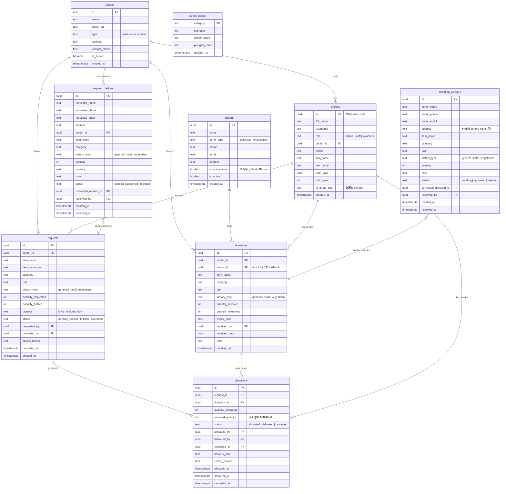
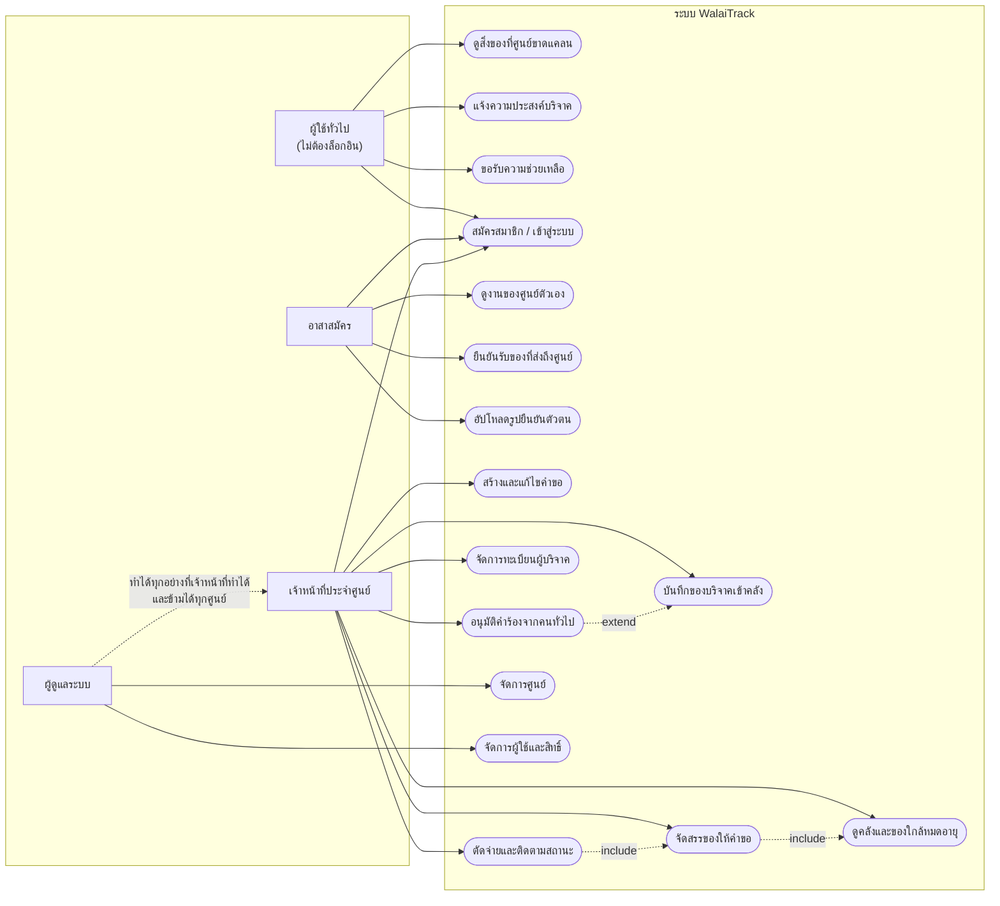

# ER Diagram และ Use Case Diagram (ฉบับล่าสุด)

สร้างจากโครงสร้างฐานข้อมูลจริงบน Supabase ณ 25 กันยายน 2569
ไม่ได้คัดลอกจากเอกสารเก่า ทุกตารางและทุกคอลัมน์ตรวจสอบกับ
`information_schema` แล้ว

วิธีทำเป็นรูป: คัดลอกโค้ดในกรอบไปวางที่ https://mermaid.live
แล้วกด Actions > PNG

---

## 1. ER Diagram

ฐานข้อมูลมี 9 ตาราง แบ่งเป็น 3 กลุ่ม

| กลุ่ม | ตาราง | หน้าที่ |
|---|---|---|
| ผู้ใช้และสถานที่ | `profiles` `centers` | ใครเป็นใคร อยู่ศูนย์ไหน |
| งานหลัก | `donors` `donations` `requests` `allocations` | ของเข้า ของขอ ของจ่าย |
| คำร้องจากคนทั่วไป | `donation_pledges` `request_pledges` `public_needs` | ยังไม่ใช่ข้อมูลจริง รอเจ้าหน้าที่อนุมัติ |

### จุดที่ควรอธิบายตอนนำเสนอ

**`allocations` เป็นตารางกลางที่ทำให้ระบบตรวจสอบย้อนหลังได้**
ของ 1 ล็อตแบ่งจ่ายได้หลายคำขอ และ 1 คำขอรับของจากหลายล็อตได้
(ความสัมพันธ์แบบกลุ่มต่อกลุ่ม) ทุกครั้งที่ตัดจ่ายจะบันทึกว่า
ใครทำ เมื่อไหร่ จำนวนเท่าไหร่ ย้อนดูได้ทุกก้าว

**`quantity_remaining` ห้ามแก้ตรง ๆ**
มี trigger `guard_donation_stock()` คอยกันไว้ ต้องแก้ผ่านฟังก์ชัน
`allocate_items` / `cancel_allocation` เท่านั้น เพื่อไม่ให้ยอดในคลัง
กับยอดที่จ่ายไปแล้วเพี้ยนจากกัน

**ตารางกลุ่ม pledges แยกจากตารางจริง**
คนทั่วไปที่ไม่ได้ล็อกอินเขียนลงได้แค่ 2 ตารางนี้ ยังไม่กระทบยอดคลัง
ต่อเมื่อเจ้าหน้าที่กดอนุมัติจึงถูกแปลงเป็น `donations` / `requests`
เป็นการกันไม่ให้ข้อมูลที่ยังไม่ตรวจสอบเข้าไปปนกับข้อมูลจริง

**ตารางคู่ต้องมีคอลัมน์ครบเท่ากัน ไม่งั้นข้อมูลหายตอนแปลง**
บทเรียนจริงจากโปรเจกต์นี้ ตอนแรก `dietary_type` มีเฉพาะในตารางจริง
ตารางคำร้องไม่มี พอกดอนุมัติจึงไม่มีค่าจะส่ง ปลายทางตกไปใช้ค่าตั้งต้น
`general` ทุกใบ ทำให้คำขออาหารฮาลาลจากประชาชนกลายเป็นอาหารทั่วไป
และกฎตรวจสอบก็ไม่ทำงาน แก้แล้วในไฟล์ `docs/sql/42`

**`donations.donor_id` เป็น NULL ได้**
ตั้งเป็น ON DELETE SET NULL ตั้งใจให้ลบผู้บริจาคได้โดยที่ใบรับของ
ที่ออกไปแล้วไม่หายตามไปด้วย

---

## 2. Use Case Diagram

ระบบมีผู้ใช้ 4 แบบ โดย "ผู้ใช้ทั่วไป" ไม่ต้องล็อกอิน

### สิ่งที่แผนภาพนี้บอก

**เจ้าหน้าที่เห็นเฉพาะศูนย์ตัวเอง ผู้ดูแลเห็นทุกศูนย์**
บังคับที่ระดับฐานข้อมูลด้วย RLS ไม่ใช่แค่ซ่อนปุ่มบนหน้าจอ
ต่อให้ยิงคำสั่งตรงเข้าฐานข้อมูลก็ยังถูกกัน

**อาสาสมัครไม่มีสิทธิ์แตะคลังหรือจัดสรร**
มีหน้าของตัวเองแยกที่ `/volunteer` เข้าหน้าเจ้าหน้าที่จะถูกเด้งออก

**คนทั่วไปทำได้ 3 อย่างโดยไม่ต้องล็อกอิน**
ดูของขาด แจ้งบริจาค ขอความช่วยเหลือ ทั้งหมดลงตารางกลุ่ม pledges
ที่ต้องผ่านการอนุมัติก่อน ไม่กระทบยอดคลังทันที
